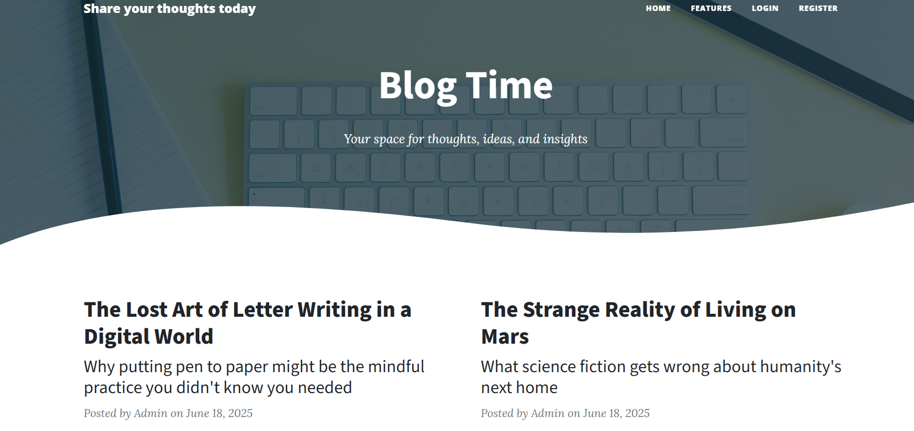

# Blog Time

A full-stack blog application demonstrating user authentication, post creation, and commenting, built with Flask, SQLAlchemy, and Bootstrap.

## Features

- User registration and login (disabled in demo)
- Create, edit, delete posts and comments
- Admin moderation
- Responsive UI

## Tech Stack
- Python, Flask, SQLAlchemy, Bootstrap

